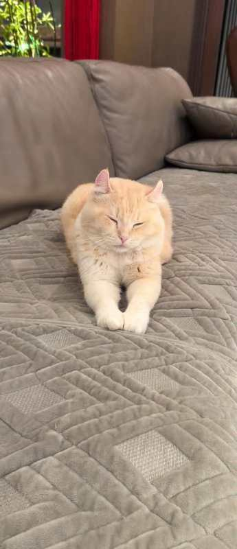

# This is somebody's awesome website, not mine

This is an **awesome website** about data science and elmo?

Sometimes I use [google](http://ww.google.com/) to do data science when I'm stuck. 

This is Ziqi's cat. Not mine. So when will she give me one? I want a black cat and a white cat. 

if you'd like to learn more about this website, visit [this page](about.html)

if you want to look a random plot, although I don't know why, you can check it [here] (plots.html)